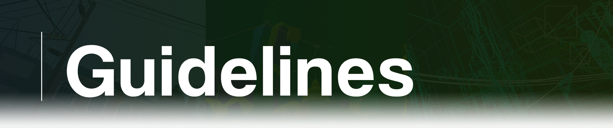

<!DOCTYPE html>

    

Welcome!  
Before contributing to any project, please read the guidelines below carefully to understand how we work, our requirements, and the best practices we expect.

## How We Work

We value quality, consistency, and clarity in all our translations and translation-related projects. To ensure this, we follow a set of internal rules and policies:

- **Source Language**: We only translate content that was originally written in English (or the intended language the final player will understand). This ensures the fidelity and immersion of the content.

- **Central Management**: All translations and final decisions are managed by the core team at Source BR.  
  Contributors can suggest changes, corrections, and submit their translations to us, but the final validation is always done by us.

- **Support**: We are always available to help contributors translate our projects into their language by creating documentation and communicating directly via Discord.

- **Credits**: All contributions will be properly credited. Contributors involved in projects will receive appropriate credits in the final files/documentation.

## Code of Conduct

- **Respect above all**: Respect other team members and contributors.

- **Be clear and concise**: When suggesting changes or corrections, explain your reasoning and provide examples whenever possible.

- **Follow the project’s style**: Each project may have its own particularities (e.g., formatting, tone of language). Make sure to follow the established standard.

- **Review before submitting**: Simple mistakes can be avoided with a quick review. We appreciate your care!

## Communication

Have questions, suggestions, or found an error? Contact us through our official channels:

Or open an *issue* directly in the repository if your comment is project-related.

## Thank You!

We appreciate your collaboration and interest in being a part of Source BR.  
Together, we can keep the Source Engine community alive!