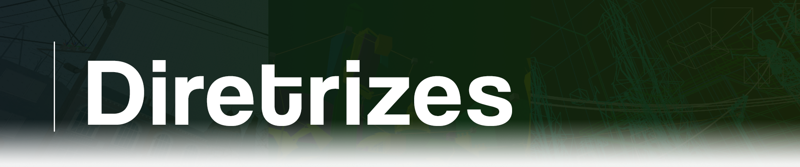

<!DOCTYPE html>

    

Bem-vindo(a) as nossas diretrizes!  
Antes de contribuir com qualquer projeto, leia atentamente as diretrizes abaixo para entender como trabalhamos, nossos requisitos e as boas práticas esperadas.

## Como Trabalhamos

Prezamos pela qualidade, coerência e clareza em todas as nossas traduções e projetos relacionados à tradução. Para isso, seguimos algumas regras e políticas internas:

- **Idioma de Origem**: Só traduzimos conteúdos que estão originalmente em inglês (ou no idioma pretendido que o jogador final entenda). Isso garante a fidelidade e imerção do conteúdo.

- **Gestão Central**: Todas as traduções e decisões finais são gerenciadas pela equipe principal da Source BR.  
  Colaboradores podem sugerir alterações, correções e enviar suas traduções para a gente, mas a validação final é sempre feita por nós.

- **Apoio**: Nós estamos centrte dispostos a ajudar os colaboradores a traduzir os nossos projetos para o seu idioma, criando documentações e conversando diretamente pelo Discord.

- **Créditos**: Toda contribuição será devidamente reconhecida. Os colaboradores que participarem de projetos receberão créditos apropriados nos arquivos/documentação final.

## Boas Condutas

- **Respeito acima de tudo**: Respeite os outros membros da equipe e colaboradores.

- **Seja claro e objetivo**: Ao sugerir mudanças ou correções, explique seu raciocínio e forneça exemplos sempre que possível.

- **Siga o estilo do projeto**: Cada projeto pode ter suas particularidades (ex: formatação, tom da linguagem). Certifique-se de seguir o padrão estabelecido.

- **Revise antes de enviar**: Erros simples podem ser evitados com uma revisão rápida. Agradecemos o cuidado!

- **Créditos**: Ao usar, distribuir ou alterar algum projeto nosso, dê os devidos créditos.

## Comunicação

Tem alguma dúvida, sugestão ou encontrou um erro? Entre em contato conosco pelos nossos canais oficiais:

Ou abra uma *issue* diretamente no repositório, caso seu comentário esteja relacionado a ao projeto.
