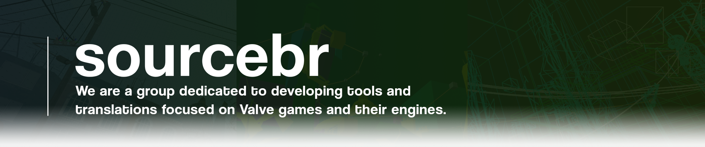

<!DOCTYPE html>

    

###

### Team:

**We are a team of 7 members**

  <table>
    <tr align="center">
      <td>
        
         
        <b>David</b>
         
        <i>Founder</i>
      </td>
      <td>
        
         
        <b>Kenned</b>
         
        <i>Co-owner</i>
      </td>
      <td>
        
         
        <b>AG1</b>
         
        <i>Translator</i>
      </td>
      <td>
        
         
        <b>Jv132</b>
         
        <i>Graphic editor</i>
      </td>
      <td>
        
         
        <b>TheoVMDM</b>
         
        <i>Graphic editor</i>
      </td>
      <td>
        
         
        <b>KaPA</b>
         
        <i>Mapper</i>
      </td>
      <td>
        
         
        <b>ZeraaMan14</b>
         
        <i>Proofreader</i>
      </td> 
    </tr>
  </table>

### Donate:

If you like our work, consider supporting us in developing our projects. By supporting us, you help us continue creating even more projects 💚

 

##

> [!NOTE]
> If you use any project made by us from one of our repositories, we kindly ask you to give proper credit.
