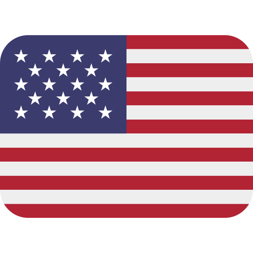

<!DOCTYPE html>

    

###

### Doar:

Se você gosta do nosso trabalho, considere nos dar suporte para o desenvolvimento dos projetos. Ao nos dar suporte, você nos ajuda a continuar desenvolvendo ainda mais projetos 💚

##

> [!NOTE]
> Se você for utilizar algum projeto feito por nós de algum repositório nosso, pedimos que coloque os devidos créditos.
